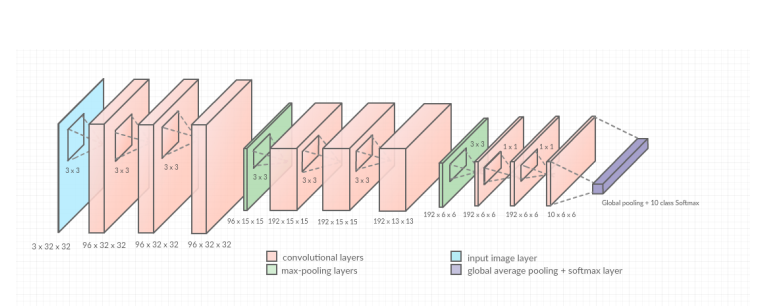
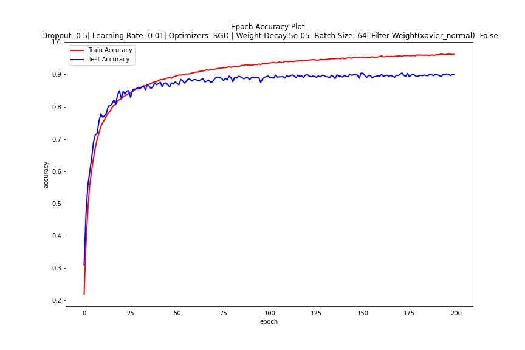
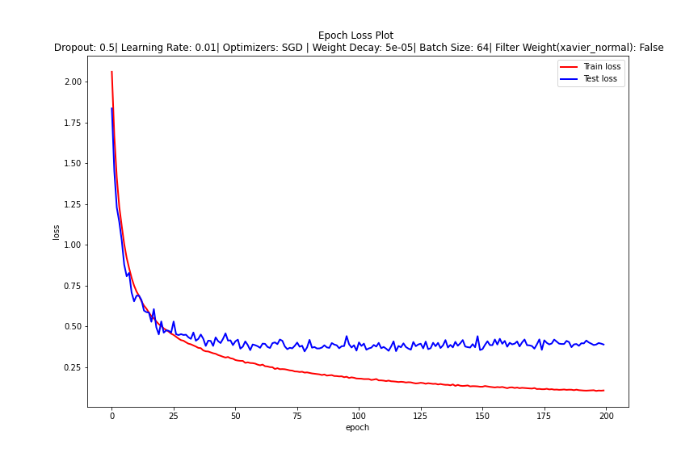

 # CNN based CIFAR-10 Image Classifier 

This repository showcases two CNN image classifiers trained using different architectures. The first model utilizes the All-CNN architecture, achieving 90% accuracy with the Keras framework. The second model is based on the LeNet-5 architecture, attaining 74% accuracy using PyTorch. 

## All - CNN Net Architecture using Keras 

Inspired by the [Striving for Simplicity - All Convolution Net](https://arxiv.org/abs/1412.6806) paper, this model is a modified version of the All-CNN architecture, achieving 95% accuracy. The architecture includes changes like using max-pooling instead of a fully convolutional network, while maintaining around 1.3 million trainable parameters. These alterations were made intentionally to study the impact of specific layers in convolutional neural networks.

 

### Building Instructions 

The source code supports training the model from scratch or loading the pre-trained model, which achieves 95% accuracy. To build the source code, follow these steps:
```
$ git clone git@github.com:magladze/public_cnn_cifar_img_class.git
$ cd Net_Keras
$ python3 CIFAR-10_CNN.py train 
``` 
For loading the pre-trained model:
```
$ cd Net_Keras
$ python3 CIFAR-10_CNN.py load
```

### Performance Visualization 

The accuracy-epoch and loss-epoch performance curves after 200 epochs are shown below:



 

## LeNet-5 Architecture using PyTorch 

LeNet-5, a fundamental architecture, performs reasonably well on the CIFAR-10 dataset with approximately 395k learnable parameters. This model, achieving 74% accuracy in PyTorch, was trained on Google Colab.

### Historical Context 

The LeNet architecture, developed by Yann LeCun in the 1990s, played a crucial role in the advancement of convolutional neural networks (CNNs). LeNet-5, specifically, was one of the pioneering CNN architectures, demonstrating the potential of deep learning in image recognition tasks. This historical significance makes studying and implementing LeNet architectures like LeNet-5 compelling in the context of modern image classification research. 